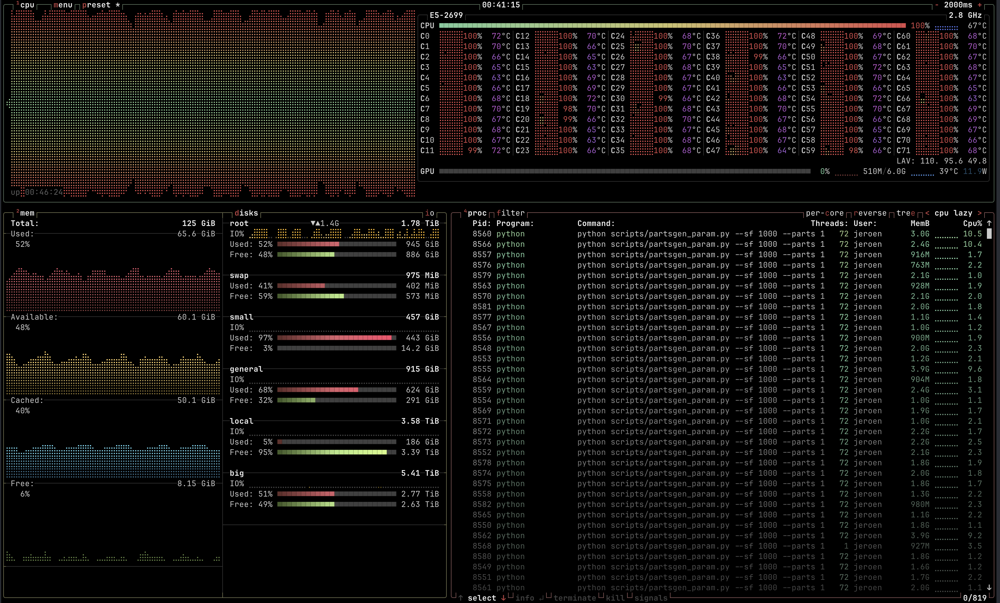
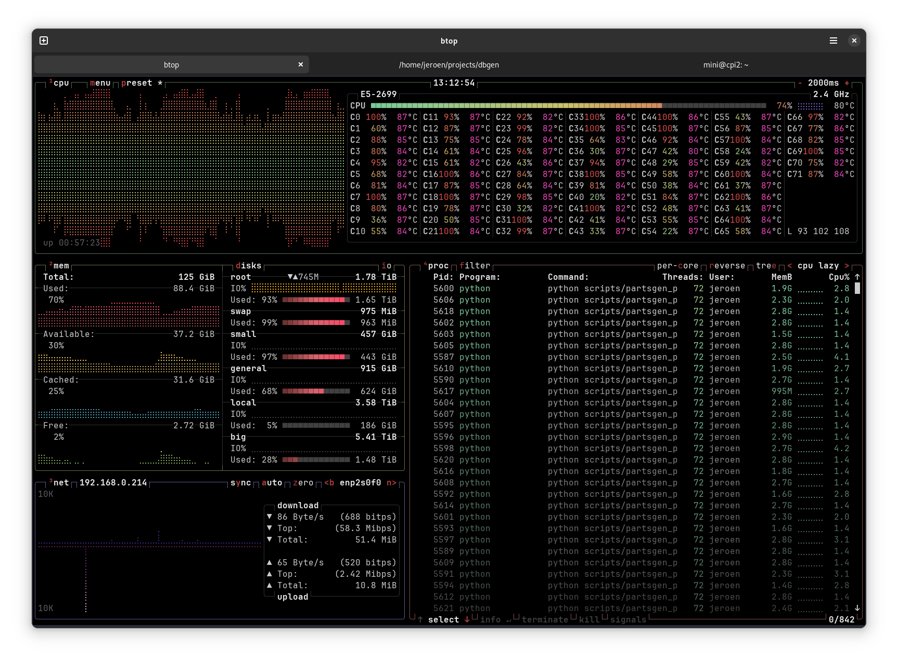

# dbgen

Standalone partitioned version of duckdb's TPC-H decision-making benchmark dataset generation.  It's basically a wrapper around duckdb's ```dbgen(sf, children, step)```.

This is a prereq for further benchmarking different frameworks, for which I'm building a benchmarking framework with a runner/scheduler, prometheus and grafana.  For that, I needed datasets stored in multiple parquet files rather than just 1 file, and duckdb just happens to have this built-in.  For just generating the data, have a look at the [tpc-h standalone dbgen tool](https://www.tpc.org/tpc_documents_current_versions/current_specifications5.asp).  Duckdb has a python package, supports splitting the workload in parts as well, knows parquet and s3.  This keeps things extremely simple while still ticking all the boxes.

This is not the real benchmark.  It generates the data required for the benchmarks.  However, generating the data does stress the system pretty hard.


I have a distributed version using ray, but here, for simplicity and if you have the patience and hardware, we're using asyncio and ProcessPoolExecutor with reusable workers (which easily translates to ie. remote [ray](https://github.com/dmatrix/ray-core-tutorial) workers).

Using python, obviously, you'l need to install duckdb with the following prereqs:
- duckdb
- asyncio

TIP: save yourself some time and use [uv](https://docs.astral.sh/uv/) to install the above in a virtual environment.

```shell
$ uv pip install -r requirements.txt 
Resolved 2 packages in 107ms
Installed 2 packages in 11ms
 + asyncio==3.4.3
 + duckdb==1.1.3
$
```

# gist

Define a scale factor, choose the number of partitions, number of worker processes and output location, and sit back and measure temps as this will take a while and contribute to global warming.

Start with scale factor 1, 3 and 10 and work your way up to 3000.

Find the balance between scaling up and scaling out: less processes = more memory usage, more processes = more overhead. 
A 1/1 ratio for scaling factor/partitions worked pretty well, but I expect to further dynamically tune based on performance/hardware with the benchmarking framework later.

For concurrency, start with the number of cores, minus 1. On a machine with 36 cores/72 threads, 35 processes has been consistently stable. 
WARNING: Too many processes will trigger segfaults.  I guess python, duckdb and C++ have their limits on thread safety.  Duckdb will use all of the available virtual cores for each process, so expect scheduling overhead.  

Find the balance so the cpu and memory stay as close to 100% as possible, without stalling the system.

For more information, see this [duckdb extension doc](https://duckdb.org/docs/extensions/tpch) and this [TPC-H paper](https://www.tpc.org/tpch/).

I recommend using [btop](https://github.com/aristocratos/btop) for realtime monitoring your hardware, but [glances](https://github.com/nicolargo/glances), [htop](https://github.com/htop-dev/htop), classic top and sar, [xymon](https://www.xymon.com/), .. of course will work equally well.


There is a local version, as well as an s3 compatible one.
### local
```shell
(venv) $ python scripts/partsgen_param.py --help
usage: partsgen_param.py [-h] [--sf SF] [--parts PARTS] --output OUTPUT [--concurrency CONCURRENCY]

Generate TPC-H Benchmark parquet data using duckdb.

options:
  -h, --help            show this help message and exit
  --sf SF               Scale Factor (default is 1, range: 1, 3, 10, 30, 100, 300, 1000, 3000).
  --parts PARTS         Number of parquet files (default is 10). 0 for no partitioning.
  --output OUTPUT       Output location on disk.
  --concurrency CONCURRENCY
                        Number of concurrent processes

(venv) $ 
```

### s3
```shell
(venv) $ python scripts/partsgen_param_s3.py --help
usage: partsgen_param_s3.py [-h] [--sf SF] [--parts PARTS] --bucket BUCKET --prefix PREFIX
                            [--concurrency CONCURRENCY] [--endpoint ENDPOINT]

Generate TPC-H Benchmark parquet data using duckdb.

options:
  -h, --help            show this help message and exit
  --sf SF               Scale Factor (default is 1, range: 1, 3, 10, 30, 100, 300, 1000, 3000).
  --parts PARTS         Number of parquet files (default is 10). 0 for no partitioning.
  --bucket BUCKET       bucket on s3.
  --prefix PREFIX       prefix on s3.
  --concurrency CONCURRENCY
                        Number of concurrent processes
  --endpoint ENDPOINT   s3 endpoint
(venv) $ 
```

# example
running sf 1000

hardware: dual E5-2699 v3 Xeon, 128GB DDR4 2100MHz RAM, WD Blue SN580 NVMe 2TB SSD Drive on PCIx gen3

```shell
(venv) $ time python scripts/partsgen_param.py --sf 1000 --parts 1000 --output /home/thisguy/data/gen1000 --concurrency 35
2025-01-04 00:34:23,537 [INFO] Parquet files will be saved to '/home/thisguy/data/gen1000' (in table dir).
2025-01-04 00:34:23,537 [INFO] Parquet files will be saved to '/home/thisguy/data/gen1000' (in table dir).
2025-01-04 00:34:23,537 [INFO] Parquet files will be saved to '/home/thisguy/data/gen1000' (in table dir).
...
(a few moments later)
...
2025-01-04 00:49:36,098 [INFO] Data generation and export process completed.

real    15m12.960s
user    948m4.294s
sys     78m7.294s
(venv) $
```

yielding this load:




The workstation I found on ebay needed some hardware reconfiguring to avoid permanent damage:

